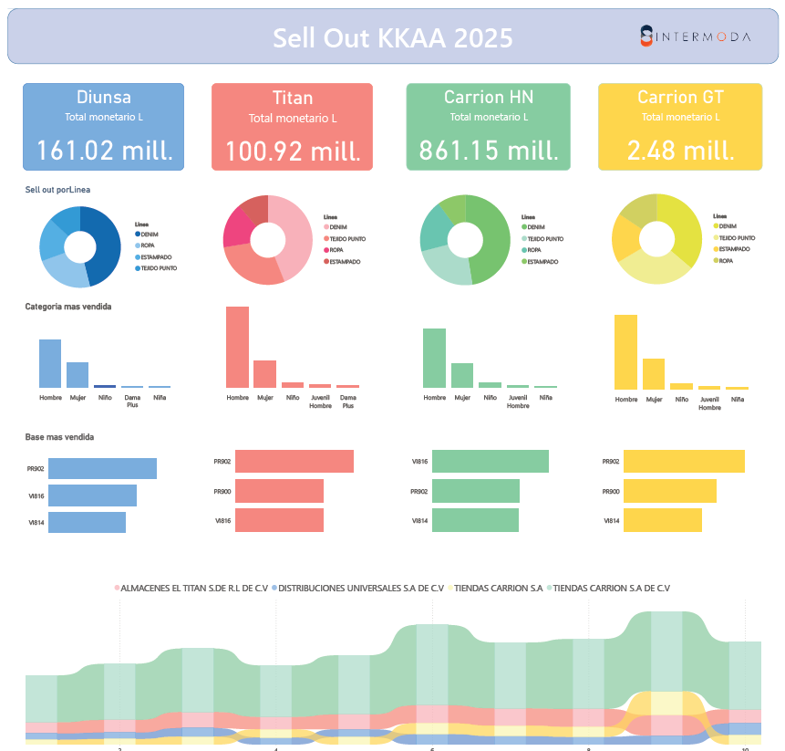

# Key Accounts Summary: Sell-Out & Inventory 2025

> A **Power BI project** for visualizing **key accounts performance** with a focus on **sell-out data** and **inventory metrics** for 2025.  
> Developed as a **real professional project** for actionable insights.

This repository contains a **Power BI project** for summarizing key accounts performance, focusing on **sell-out data and inventory metrics** for 2025. This project was developed for a real work scenario, aiming to provide insights into inventory levels and costs in a visually intuitive manner.




> ⚠️ **Note:** The full data model and additional measures are **proprietary and confidential**, and are not included in this repository.

## 📝 Project Overview

This repository includes:

- ✅ **Key Inventory Indicators**  
- ✅ **Inventory Cost Summary Cards**  
  ✅ **Theme.json** 
- ✅ **PDF summary report** for easy sharing  

> ⚠️ **Note:** The full data model and additional measures are **proprietary and confidential**.

---

## Included Measures (DAX)

Below are two key measures implemented in this project:

### 1. `Indicador Inventario`
```DAX
Indicador Inventario = 
VAR Meses = [Meses Inventario Promedio]
RETURN
SWITCH(
    TRUE(),
    Meses >= 0 && Meses < 3, " ➡️",
    Meses >= 3 && Meses <= 5, " ⬆️",
    Meses > 5, " ⬇️",
    "⚪"  -- If no data
)
Description:
Assigns an inventory indicator icon based on the average months of inventory:

➡️ for 0–3 months

⬆️ for 3–5 months

⬇️ for more than 5 months

⚪ if there is no data

Inventario Card = 
VAR Costo = FORMAT(DIVIDE([Costo Total Inventario],1000000),"0.0") & " mill"
VAR Meses = FORMAT([Meses Inventario Promedio],"0.0")
VAR Indicador = [Indicador Inventario]
RETURN
"Costo total: " & Costo & UNICHAR(10) & 
"Meses de inventario: " & Meses & " " & Indicador


PDF Report: [📥 Download Full PDF](./Performance_KKAA/Resumen_KKAA.pdf)

A PDF summary report has been included in the repository:
Resumen KKAA 2025
You can download the full PDF report here:
Download Resumen KKAA 2025

Contact me: ![LinkedIn] (https://linkedin.com/in/bryanxavez)

This report visualizes key metrics and insights derived from the Power BI model.


License / Disclaimer

This project is intended for internal professional use. Data and full model structures are confidential and proprietary to the company.


